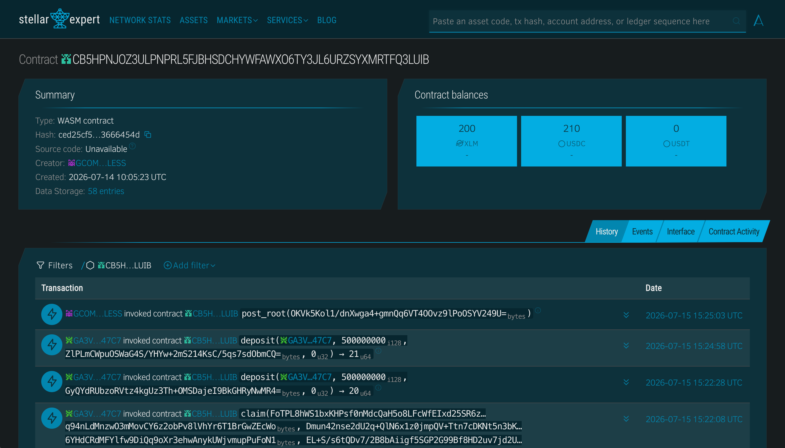

# Bullet

## Problem

Sending crypto on Stellar leaves a public trail. Every transaction creates a visible `sender -> recipient` edge on-chain. Anyone watching the chain learns who paid whom, how much, and how often. This lack of payment privacy makes Stellar unsuitable for salary payments, donations, remittances, and any transfer where the sender-recipient relationship should stay confidential.

## Vision

A world where sending money on Stellar is as private as handing someone cash. Bullet is the foundation for a full shielded payment layer on Stellar, starting with unlinkable fixed-denomination notes today and evolving toward encrypted balances with Pedersen commitments and range proofs. The long-term goal is private, compliant payments at scale, with selective disclosure so users can prove payments to auditors without making them public.

## Purpose

We built Bullet because privacy is a prerequisite for real financial inclusion. Workers sending money home, individuals receiving donations, and businesses paying contractors all deserve payment privacy. Stellar has the speed and cost structure for global payments but lacks privacy infrastructure. Bullet fills that gap using zero-knowledge proofs that are verified directly on-chain using Soroban's native BLS12-381 host functions.

## Target Users

- **Individuals** sending private payments to friends, family, or contacts via X handle or email, without exposing the sender-recipient relationship on-chain.
- **Freelancers and contractors** receiving payments where the payer-payee link should not be publicly visible on a block explorer.
- **Remittance senders** who want to send stablecoins (USDC/USDT) or XLM to recipients identified by social handle rather than wallet address, with no public trace connecting the two parties.

## Features

- **ZK-private claims** -- Groth16 proofs verified on-chain via Soroban's native BLS12-381 host functions. Nothing on-chain connects a deposit to its claim.
- **Social-handle addressing** -- Send to an X handle or email. The resolver maps handles to recipient keys. No wallet address exchange needed.
- **Multi-token support** -- USDC, XLM, and USDT. Token ID is bound in the ZK circuit to prevent cross-token drains.
- **Browser-side proving** -- The secret never leaves the browser. snarkjs generates Groth16 proofs in-browser via WASM in ~15-30 seconds.
- **Private inbox** -- Sender-authored encrypted notes (X25519 ECDH) let recipients discover claimable payments without any server seeing the plaintext.
- **Invite flow** -- Send to unregistered users via claim link. Custody keypair handles the claim, then forwards tokens to the recipient's real wallet.
- **Nullifier-based double-spend protection** -- Each note can only be claimed once. The contract stores every nullifier permanently.

## Tech Stack

- **Frontend:** Next.js 15, Tailwind CSS 4, Freighter wallet integration
- **Backend:** Node.js, Express, TypeScript, Supabase (Postgres + Auth)
- **Blockchain:** Stellar Soroban (Rust), native BLS12-381 host functions, Stellar SDK v16
- **ZK:** Circom 2.2.3, snarkjs 0.7.5, Groth16 over BLS12-381, depth-20 Poseidon Merkle tree
- **Auth:** Supabase Auth (Google + X OAuth), cookie sessions via `@supabase/ssr`

## How to Run Locally

```bash
git clone https://github.com/mdla03/bullet.git
cd bullet
cp .env.example .env    # fill in values
pnpm install
pnpm dev                # starts backend + frontend
```

Circuit regeneration (only needed if you change `circuits/claim.circom`):

```bash
pnpm build:circuits     # circom -> r1cs -> Groth16 setup -> vk -> fixture
```

Requirements: Node 20+, pnpm 9. Rust + Soroban toolchain for contracts.

## Deployment

### Testnet

- **Contract Address:** [`CB5HPNJOZ3ULPNPRL5FJBHSDCHYWFAWXO6TY3JL6URZSYXMRTFQ3LUIB`](https://stellar.expert/explorer/testnet/contract/CB5HPNJOZ3ULPNPRL5FJBHSDCHYWFAWXO6TY3JL6URZSYXMRTFQ3LUIB)
- **USDC SAC:** [`CBIELTK6YBZJU5UP2WWQEUCYKLPU6AUNZ2BQ4WWFEIE3USCIHMXQDAMA`](https://stellar.expert/explorer/testnet/contract/CBIELTK6YBZJU5UP2WWQEUCYKLPU6AUNZ2BQ4WWFEIE3USCIHMXQDAMA)
- **XLM SAC:** [`CDLZFC3SYJYDZT7K67VZ75HPJVIEUVNIXF47ZG2FB2RMQQVU2HHGCYSC`](https://stellar.expert/explorer/testnet/contract/CDLZFC3SYJYDZT7K67VZ75HPJVIEUVNIXF47ZG2FB2RMQQVU2HHGCYSC)
- **USDT SAC:** [`CBL6KD2LFMLAUKFFWNNXWOXFN73GAXLEA4WMJRLQ5L76DMYTM3KWQVJN`](https://stellar.expert/explorer/testnet/contract/CBL6KD2LFMLAUKFFWNNXWOXFN73GAXLEA4WMJRLQ5L76DMYTM3KWQVJN)
- **Frontend:** Vercel
- **Backend:** Railway



### Mainnet

Not deployed. Testnet only. Own (non-MPC) trusted setup. Not audited.

## Demo

- Live App: https://sendbullet.xyz
- Demo Video: https://drive.google.com/file/d/12_d1DzgBn8U-fFspGnOv7UIbnBoLdGGI/view?usp=sharing
- Pitch Deck: https://canva.link/r7v03xtursupg3u

## Architecture

See `architecture_diagram.svg` for the full system diagram and `bullet_zk_architecture.pdf` for detailed technical documentation.

### How the ZK proof works

Bullet's zero-knowledge proof is load-bearing. Without it, the contract has no way to authorize a claim without revealing which deposit is being claimed.

The Groth16 circuit (`circuits/claim.circom`) proves:

1. **Merkle membership** -- `Poseidon(secret, recipientDigest, amount, tokenId)` hashes up through a depth-20 Poseidon path to a known root.
2. **Nullifier derivation** -- `nullifier = Poseidon(secret)`, domain-separated from the commitment (arity-1 vs arity-4).
3. **Value binding** -- `amount` and `tokenId` are inside the commitment, so a deposit of token A cannot be claimed as token B, and the claimed amount must match.

Five public inputs `[root, nullifier, recipientDigest, amount, tokenId]` are verified on-chain. The secret and Merkle path stay private. Verification uses Soroban's native `bls12_381` pairing_check at ~70% of the per-tx CPU budget.

### Honest privacy limits

- **Fixed denominations, not encrypted balances.** Amounts are standardized (1, 10, 50, 100 USDC), not hidden. Privacy comes from every payment looking the same size. Encrypted balances are future work.
- **Anonymity scales with pool size.** At demo scale the set is small.
- **Merkle root posted by a relayer.** On-chain Poseidon insertion exceeds the per-tx budget, so the tree is built off-chain and an admin posts roots. Decentralizing this is future work.
- **Trusted setup is single-contributor.** Production path is an MPC ceremony.
- **Delivery channels can be non-private.** Claim links and email delivery are trusted at the sender's discretion. On-chain unlinkability holds regardless.

## Repo layout

```
bullet/
├── SPEC.md              full spec, binding P0 scope
├── contracts/            Cargo workspace: zeekpay (main), verifier (Groth16)
├── circuits/             Circom source, build artifacts, scripts
├── backend/              resolver + indexer + Merkle tree + Supabase store
├── frontend/             Next.js app
├── shared/               shared TS types
└── scripts/              deploy + e2e demo scripts
```

## Team

| Name                     | Role             | GitHub          |
|--------------------------|------------------|-----------------|
| Mark Daniels Aquino      | Full Stack + ZK  | @mdla03         |
| Clarence Kyle Pagunsan   | Full Stack + ZK  | @laughable-9    |
| Elfritz Angelo Peralta   | Product Manager  | @elfrtz         |

## License

MIT
